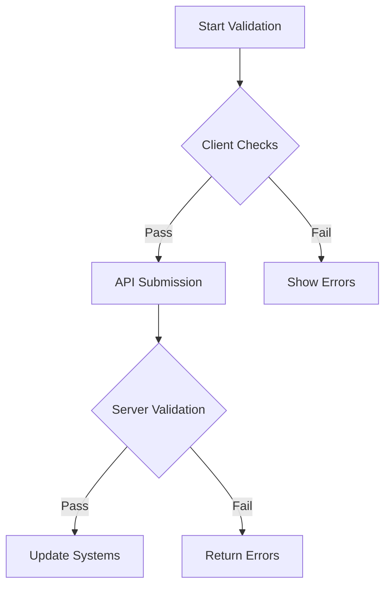
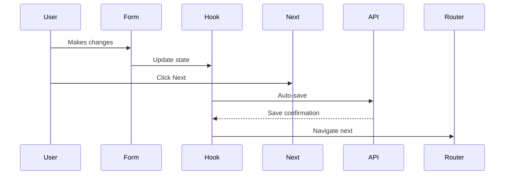

# `useTransactionData` Custom Hook Documentation

A React hook for managing transaction details data entry, validation, and submission. Handles complex form state, API interactions, and navigation logic while providing validation feedback and read-only modes.

## Features

- 🏗️ **Form State Management**  
  Persists form data in localStorage & manages complex transaction types
- 🔄 **API Integration**  
  Fetches/updates transactions via `transactionapi` service
- ✅ **Validation System**  
  Integrated validation hooks and error display handling
- 📴 **Read-Only Modes**  
  Supports view-only modes via URL parameters
- 📬 **Modal Feedback System**  
  Unified message display system for user feedback
- 🔗 **Routing Integration**  
  Seamless navigation with state preservation

## Hook Parameters

| Parameter | Type | Description |
|-----------|------|-------------|
| `requestId` | string | Required parent request identifier |

## Return Object

### State Properties

| Property | Type | Description |
|----------|------|-------------|
| `formData` | Object | Current transaction data |
| `isReadOnly` | boolean | Global edit lock state |
| `hasUnsavedChanges` | boolean | Dirty state indicator |
| `modalOpen` | boolean | Modal visibility state |
| `modalMessage` | ReactNode | Modal content component |
| `existingTransactions` | Array | List of related transactions |

### Methods

| Method | Parameters | Description |
|--------|------------|-------------|
| `handleChange` | `event` | Universal input change handler |
| `handleSubmit` | `saveType` | Data submission handler |
| `validatePage` | - | Full transaction validation |
| `handleNext` | - | Navigation & auto-save handler |
| `updateFormData` | `event` | Direct form update method |

## Usage Example

```jsx
import { useTransactionData } from '@hooks/useTransactionData';

const TransactionForm = () => {
  const {
    formData,
    isReadOnly,
    handleChange,
    handleSubmit,
    validatePage,
    modalOpen,
    modalMessage
  } = useTransactionData();

  return (
    <>
      <form>
        <input
          name="transactionType"
          value={formData.transactionType}
          onChange={handleChange}
          disabled={isReadOnly}
        />
        {/* Additional form fields */}
      </form>
      
      <Modal open={modalOpen}>
        {modalMessage}
      </Modal>
    </>
  );
};
```

## Validation System

Implements multi-layer validation:

1. **Client-Side Validation**  
   - Required field checks
   - Data format validation
   - Cross-field validation

2. **Server-Side Validation**  
   - Business logic validation
   - Data integrity checks
   - External system verification



## Transaction Types

Handles special logic for:

- **Sales Transactions**
  - Requires purchase price
  - Disables rental fields
  
- **Purchase Transactions**
  - Requires sale price
  - Disables rental fields

- **Letting Transactions**
  - Requires rental rate
  - Disables sale/purchase fields

## API Endpoints

| Endpoint | Method | Purpose |
|----------|--------|---------|
| `/transactions` | GET | List transactions |
| `/transactions/{id}` | GET | Get single transaction |
| `/transactions/{id}` | PUT | Update transaction |
| `/validate-transaction` | POST | Server validation |

## Error Handling

Displays structured errors in modal:

```js
{
  "fieldName": ["Error 1", "Error 2"],
  "amount": ["Must be positive number"]
}
```

## Persistence

- **Auto-Save** - Local storage every 30s
- **Session Recovery** - Restores form state on reload
- **Draft System** - Maintains unsaved changes

## Navigation Flow



## Best Practices

1. **Wrap Form Components**  
   Use providers for state sharing

2. **Implement Loading States**  
   Use `loading` property for UI feedback

3. **Handle Validation Early**  
   Validate before critical actions

4. **Use Read-Only Flags**  
   Respect `isReadOnly` for UI controls

5. **Monitor Unsaved Changes**  
   Use `hasUnsavedChanges` for navigation guards

## Troubleshooting

**Common Issues:**

| Symptom | Solution |
|---------|----------|
| Missing transaction ID | Check localStorage for draft data |
| Validation not triggering | Verify required field completion |
| Read-only mode active | Check URL parameters and transaction status |
| API errors | Verify network connectivity and auth tokens |

```bash
# Debug Commands
localStorage.debug = 'useTransactionData:*';
```
